# Supporting Artifacts — Brickly

> This document bundles the six supporting planning artifacts referenced from the [Project Charter](PROJECT_CHARTER.md): the Stakeholder Register, Risk Register, Work Breakdown Structure, Communication Plan, SMART Goals Brief, and KPI Tracking template. Each section is self-contained; jump to the one you need via the table of contents your viewer renders.

---

## Stakeholder Register

Closes issue #2.

### Identified stakeholders

| ID | Name / Role | Type | Interest | Influence | Communication preference | Engagement strategy |
|---|---|---|---|---|---|---|
| S1 | Course instructor | Sponsor | High | High | Email + repo link | Manage closely. Mid-project email update + final demo. |
| S2 | Kaan Yazıcıoğlu | PM + Frontend | High | High | All channels | Manage closely. Owns daily decisions. |
| S3 | Caner Akcasu | Backend + AI + QA | High | High | WhatsApp + GitHub | Manage closely. Co-decision on tech and scope. |
| S4 | Classmates (audience) | Observer | Low | Low | In-class presentation | Inform. Deliver a clear demo. |
| S5 | DeepSeek (AI vendor) | Supplier | Low | Medium | Vendor status page / docs | Monitor. Check status before demo; have fallback. |
| S6 | Vercel / Railway | Hosting suppliers | Low | Medium | Status pages | Monitor. Pre-deploy by Day 8. |
| S7 | Future Brickly users | End users | High | Low | (Hypothetical) | Inform via charter language; design with personas. |
| S8 | Open-source library maintainers | External dependency | Low | Low | GitHub | Monitor. Pin versions; don't auto-update mid-project. |

### Power / Interest grid

```
  Influence
    High |  [S1]                  [S2, S3]
         |  Manage Closely        Manage Closely
    Med  |  [S5, S6]              
         |  Monitor               
    Low  |  [S4, S8]              [S7]
         |  Inform-only           Inform / design for
         +-----------------------------------------
              Low                  High
                          Interest
```

### Engagement frequency

| Stakeholder | Touchpoint | Frequency |
|---|---|---|
| Instructor | Repo activity (public) | Continuous |
| Instructor | Mid-project email | Once, end of Week 1 |
| Instructor | Final presentation | Once, May 18 |
| Caner | Daily standup | Every working day, 09:30 |
| Caner | Async via Issues | Continuous |
| DeepSeek status | Status page check | Daily 09:00 |

---

## Risk Register

Closes issue #4. Updated through the project; see issue #4 comments for living changes.

### Risk categories used

- **TECH** — technical, AI, hosting, dependencies
- **TIME** — schedule, deadlines
- **SCOPE** — feature creep, requirements drift
- **TEAM** — communication, availability, capability
- **EXT** — external (vendor, infrastructure)

### Risks

| ID | Category | Description | Likelihood (L/M/H) | Impact (L/M/H) | Score | Owner | Mitigation | Contingency |
|---|---|---|---|---|---|---|---|---|
| R1 | EXT | DeepSeek API downtime or rate-limit hit during demo | M | H | 6 | Caner | Pre-cache 3 sample responses; adapter interface so swap to OpenAI/Gemini takes 5 min | Demo runs against cached responses, narrated as "in case of outage we use these" |
| R2 | SCOPE | Scope creep — team keeps adding AI features (voice, calendar, social) | H | H | 9 | Kaan (PM) | Charter's out-of-scope list is the contract; weekly scope check | All new ideas logged as "Brickly v2" backlog; deferred without debate |
| R3 | TEAM | One team member ill or absent ≥ 1 day | L | H | 3 | Both | Daily standup catches early; cross-train on key tasks | Weekend reserve day in calendar; partner takes critical-path issues |
| R4 | TIME | Schedule slip due to Caner's mid-week university exam (May 13) | M | M | 4 | Caner | High-priority backend issues front-loaded to May 11 and May 12 | Buffer day on May 15 absorbs slip |
| R5 | TECH | AI hallucination produces nonsensical micro-tasks | M | M | 4 | Caner | Prompt engineering iterations (issue #15); structured JSON output; Zod validation | Frontend lets user edit/reject each task; document as known limitation |
| R6 | EXT | Vercel or Railway free-tier limit hit during demo | L | M | 2 | Kaan | Deploy by May 15 (Day 9); monitor usage; cap test traffic | Local dev demo as fallback (run on laptop, use phone hotspot) |
| R7 | TIME | Prompt template iteration takes longer than 2h | M | M | 4 | Caner | Time-box to 4h max; ship a "good enough" v1 even if v2 quality is better | Defer R1 model to v2; demo with V3 only |
| R8 | TECH | Database migration fails on Railway | L | H | 3 | Caner | Migrations tested locally first; idempotent migration files | Roll back via Prisma; reapply manually; worst case redeploy fresh DB |
| R9 | TEAM | Async communication breaks down — one of us misses a decision | M | M | 4 | Kaan | All decisions documented in issue comments or ADRs; verbal-only decisions explicitly forbidden | Mid-project review (#48) catches drift; reset scope at that point |
| R10 | SCOPE | We over-promise in the charter and can't deliver MVP | M | H | 6 | Both | MVP definition locked Day 2; every feature has acceptance criteria | Drop gamification animations first, then daily-goal, then badges — preserve auth + AI + task CRUD |

### Risk heat map (likelihood × impact)

```
              Low impact      Medium impact    High impact
High likelihood    -              -              R2
Medium likelihood  -      R5 R7 R9 R4            R1, R10
Low likelihood     R6        R8                  R3
```

### Top-3 risks for weekly review

- **R2** (scope creep) — most likely + highest impact combined.
- **R1** (DeepSeek outage) — biggest external dependency.
- **R10** (MVP overshoot) — strategic risk to the whole plan.

---

## Work Breakdown Structure

Closes issue #8.

### Hierarchy (3 levels)

```
1. Initiation (Phase 1)
   1.1 Project charter
       1.1.1 Charter document (#1)
       1.1.2 SMART goals brief (#3)
   1.2 Stakeholder analysis
       1.2.1 Stakeholder register (#2)
   1.3 Risk planning
       1.3.1 Initial risk register (#4)
   1.4 Communication planning
       1.4.1 Communication plan (#5)
   1.5 Infrastructure
       1.5.1 Repo + Projects board setup (#6)

2. Planning (Phase 2)
   2.1 Scope definition
       2.1.1 Scope statement (#7)
       2.1.2 Work breakdown structure (#8) [this document]
   2.2 User research
       2.2.1 User personas (#9)
       2.2.2 User flow diagram (#10)
   2.3 UX design
       2.3.1 Wireframes (#11)
       2.3.2 Hi-fi mockups (#17)
       2.3.3 Design system (#18)
       2.3.4 Gamification UI (#19)
       2.3.5 Component inventory (#20)
       2.3.6 Logo + brand (#21)
   2.4 Technical architecture
       2.4.1 Database schema (#12)
       2.4.2 API specification (#13)
       2.4.3 Tech stack ADR (#16)
   2.5 AI design
       2.5.1 DeepSeek research (#14)
       2.5.2 Prompt templates (#15)

3. Execution (Phase 3)
   3.1 Repo scaffolding
       3.1.1 Frontend repo (#22)
       3.1.2 Backend repo (#23)
       3.1.3 Tailwind setup (#24)
       3.1.4 PostgreSQL setup (#25)
       3.1.5 Routing scaffold (#26)
   3.2 Authentication
       3.2.1 Registration endpoint (#27)
       3.2.2 Login endpoint (#28)
       3.2.3 User model + migration (#30)
   3.3 Core CRUD
       3.3.1 Task CRUD endpoints (#29)
       3.3.2 Postman collection (#31)
   3.4 AI integration
       3.4.1 DeepSeek client (#32)
       3.4.2 Clarify endpoint (#33)
       3.4.3 Decompose endpoint (#34)
       3.4.4 Response parser (#35)
       3.4.5 AI error handling (#36)
   3.5 Frontend implementation
       3.5.1 Big-task input UI (#37)
       3.5.2 AI Q&A UI (#38)
       3.5.3 Task list UI (#39)
       3.5.4 Edit/accept/reject UI (#40)
       3.5.5 Status indicators (#41)
   3.6 Gamification
       3.6.1 XP + level system (#42)
       3.6.2 Streak tracking (#43)
       3.6.3 Badges (#44)
       3.6.4 Daily goal (#45)
       3.6.5 Notifications (#46)

4. Monitoring & Control (Phase 4)
   4.1 Performance tracking
       4.1.1 KPI tracking doc (#47)
       4.1.2 Mid-project review (#48)
       4.1.3 Schedule variance analysis (#49)
   4.2 Quality control
       4.2.1 Code review + CI (#50)

5. Closure (Phase 5)
   5.1 Testing
       5.1.1 E2E + smoke tests (#51)
   5.2 Deployment
       5.2.1 Production deployment (#52)
   5.3 Documentation
       5.3.1 Post-mortem (#53)
   5.4 Presentation
       5.4.1 Presentation prep (#54)
       5.4.2 Dry run (#55)
```

### Mermaid diagram source (for `docs/WBS.md`)

```mermaid
graph TD
    Brickly[Brickly Project]
    Brickly --> P1[1. Initiation]
    Brickly --> P2[2. Planning]
    Brickly --> P3[3. Execution]
    Brickly --> P4[4. Monitoring & Control]
    Brickly --> P5[5. Closure]

    P1 --> P1A[1.1 Charter]
    P1 --> P1B[1.2 Stakeholders]
    P1 --> P1C[1.3 Risks]
    P1 --> P1D[1.4 Communication]
    P1 --> P1E[1.5 Infrastructure]

    P2 --> P2A[2.1 Scope]
    P2 --> P2B[2.2 User Research]
    P2 --> P2C[2.3 UX Design]
    P2 --> P2D[2.4 Tech Architecture]
    P2 --> P2E[2.5 AI Design]

    P3 --> P3A[3.1 Scaffolding]
    P3 --> P3B[3.2 Auth]
    P3 --> P3C[3.3 CRUD]
    P3 --> P3D[3.4 AI Integration]
    P3 --> P3E[3.5 Frontend]
    P3 --> P3F[3.6 Gamification]

    P4 --> P4A[4.1 Performance]
    P4 --> P4B[4.2 Quality Control]

    P5 --> P5A[5.1 Testing]
    P5 --> P5B[5.2 Deployment]
    P5 --> P5C[5.3 Docs]
    P5 --> P5D[5.4 Presentation]
```



### Scope coverage cross-check

Every scope-statement (#7) item maps to a WBS leaf:

| Scope item | WBS node |
|---|---|
| User registration / login | 3.2 |
| Big-task input + clarification flow | 3.4.2, 3.5.1, 3.5.2 |
| AI decomposition | 3.4.3 |
| Task editing & acceptance | 3.5.4 |
| Hierarchical task list | 3.5.3 |
| Mark complete / status | 3.5.5, 3.3.1 |
| XP + levels | 3.6.1 |
| Streaks | 3.6.2 |
| Badges | 3.6.3 |
| Daily goal | 3.6.4 |
| Notifications | 3.6.5 |
| Weekly summary | (deferred to v2 — flagged in mid-project review) |
| Deployment | 5.2 |

No gaps.

---

## Communication Plan

Closes issue #5.

### Communication matrix

| Audience | Sender | Channel | Cadence | Content | Owner |
|---|---|---|---|---|---|
| Within team | Kaan / Caner | WhatsApp voice (daily standup) | Daily 09:30, ≤ 15 min | Yesterday / today / blockers | Kaan |
| Within team | Either | GitHub issue comments | Continuous | Per-task decisions, technical notes | Whoever posts |
| Within team | Either | GitHub PR review | Per PR | Code review, design feedback | PR opener |
| Within team | Kaan | In-person meeting | End of each phase (~ every 3 days) | Phase retrospective | Kaan |
| Sponsor (instructor) | Kaan | Email | Once mid-project + once at submission | Status summary, repo link | Kaan |
| Sponsor (instructor) | Both | In-class presentation | Once, May 18 | Final demo | Both |

### Daily standup template

```
DATE: 2026-05-XX
ATTENDEES: Kaan, Caner
DURATION: 15 min max

KAAN
- Yesterday: <issue #s closed>
- Today: <issue #s targeted>
- Blockers: <if any>

CANER
- Yesterday: <issue #s closed>
- Today: <issue #s targeted>
- Blockers: <if any>

DECISIONS / NOTES
- <bullet>
```

Standup notes are not committed to the repo (overhead too high), but blockers and decisions surface in the relevant issue's comments.

### Escalation path

| If… | Escalate to | Within |
|---|---|---|
| A blocker can't be resolved in 30 min of pair work | Mid-project review trigger (off-cycle if before May 13) | Same day |
| A scope question can't be answered from the charter | PM (Kaan) makes a call; logs as ADR | 24 hours |
| External tooling fails (DeepSeek, Vercel, Railway) | Activate contingency from risk register; both members align via WhatsApp | 1 hour |
| One team member is unavailable for > 24h | Partner takes over critical-path issues; charter reassignment via GitHub | Within the absence window |

### Channels & fallbacks

| Primary | Fallback |
|---|---|
| WhatsApp voice | Discord call |
| GitHub Issues (async) | Email |
| GitHub PR review | Pair-program on Discord screen-share |
| Email (to instructor) | LMS message |

---

## SMART Goals Brief

Closes issue #3.

Each objective uses the SMART framework explicitly.

### Objective 1 — Plan completeness

| SMART attribute | Detail |
|---|---|
| Specific | A GitHub Projects board with 50+ issues distributed across 5 PMBOK milestones. |
| Measurable | Issue count ≥ 50, milestone count = 5, 100% of issues tagged with priority + type + phase + assignee + effort. |
| Achievable | Issue authoring effort estimated at 8h total across both team members. |
| Relevant | The board is the primary graded artifact. |
| Time-bound | Complete by 2026-05-18 23:59. |

### Objective 2 — Documentation depth

| SMART attribute | Detail |
|---|---|
| Specific | Publish six core planning documents (Project Charter, Stakeholder Register, Risk Register, Communication Plan, WBS, SMART Goals). |
| Measurable | All 6 documents exist in `docs/`; each ≥ 1 page; each present in commit history before phase 2 closes. |
| Achievable | Total writing effort ≈ 10h; PM owns 80%, partner reviews. |
| Relevant | Demonstrates PMBOK Initiation/Planning competency to the instructor. |
| Time-bound | Complete by 2026-05-06 23:59 (end of Day 2). |

### Objective 3 — Schedule realism

| SMART attribute | Detail |
|---|---|
| Specific | All 5 milestones close on or before due date. |
| Measurable | Schedule variance (planned − actual finish, in days) ≤ 1 per milestone. |
| Achievable | Buffer day built into Phase 3; weekend reserve. |
| Relevant | Schedule control is a Phase 4 KPI; failure here voids the planning narrative. |
| Time-bound | Validated at each milestone's due date. |

### Objective 4 — Team load balance

| SMART attribute | Detail |
|---|---|
| Specific | Estimated effort hours assigned to Kaan and Caner stay within ±15%. |
| Measurable | Tracked via the `Effort (hours)` custom field; reported at the end of each phase. |
| Achievable | Issue assignments planned before execution; rebalanced at mid-project review (#48). |
| Relevant | Demonstrates resource management; addresses the assignment's "how did you divide responsibilities" question. |
| Time-bound | Validated at end of Phase 2, mid-project, and project close. |

### Objective 5 — Presentation readiness

| SMART attribute | Detail |
|---|---|
| Specific | Deliver a 5–7 minute live presentation covering tool choice, planning, responsibility split, and challenges. |
| Measurable | All 4 mandatory questions answered; presentation timed at 5:30–6:30 in dry-run (#55). |
| Achievable | Script drafted Day 9, rehearsed twice on Day 10. |
| Relevant | Final graded deliverable. |
| Time-bound | Delivered live on 2026-05-18 during the scheduled class session. |

---

## KPI Tracking (template)

Closes issue #47. Update this section daily.

### KPI table — current vs target

| ID | KPI | Target | Day 3 | Day 5 | Day 8 | Day 10 | Status |
|---|---|---|---|---|---|---|---|
| K1 | Issues created | ≥ 50 | _50 (after #6 batch) | _ | _ | _ | _ |
| K2 | Issues closed | n/a interim | _ | _ | _ | ≥ 50 | _ |
| K3 | Schedule variance (days, milestone level) | ≤ 1 day | _ | _ | _ | _ | _ |
| K4 | Kaan effort / Caner effort ratio | 0.85 – 1.15 | _ | _ | _ | _ | _ |
| K5 | Number of risks materialized | < 30% of register | _ | _ | _ | _ | _ |
| K6 | Documentation count in `docs/` | ≥ 6 by Day 2 | _ | _ | _ | _ | _ |
| K7 | Deployment uptime (post-deploy) | 100% on demo day | n/a | n/a | n/a | _ | _ |
| K8 | E2E smoke test pass rate | 100% by Day 10 | n/a | n/a | _ | _ | _ |

(Fill `_` cells during the project.)

### Variance log

When a KPI deviates by more than 15% from target, add a row here with the cause and corrective action.

| Date | KPI | Target | Actual | Variance | Cause | Action |
|---|---|---|---|---|---|---|
| — | — | — | — | — | — | — |

---

## Cross-reference summary

| Document | Issue closed | Repo path (recommended) |
|---|---|---|
| Stakeholder Register | #2 | `docs/STAKEHOLDER_REGISTER.md` |
| Risk Register | #4 | `docs/RISK_REGISTER.md` |
| Work Breakdown Structure | #8 | `docs/WBS.md` |
| Communication Plan | #5 | `docs/COMMUNICATION_PLAN.md` |
| SMART Goals Brief | #3 | `docs/SMART_GOALS.md` |
| KPI Tracking | #47 (living) | `docs/KPI_TRACKING.md` |
