# Work Breakdown Structure — Brickly

> Phase 2 (Planning) deliverable. Closes issue [#8](https://github.com/kaanzapkinus/brickly-project-plan/issues/8).

## Hierarchy (3 levels)

```
1. Initiation (Phase 1)
   1.1 Project charter
       1.1.1 Charter document (#1)
       1.1.2 SMART goals brief (#3)
   1.2 Stakeholder analysis
       1.2.1 Stakeholder register (#2)
   1.3 Risk planning
       1.3.1 Initial risk register (#4)
   1.4 Communication planning
       1.4.1 Communication plan (#5)
   1.5 Infrastructure
       1.5.1 Repo + Projects board setup (#6)

2. Planning (Phase 2)
   2.1 Scope definition
       2.1.1 Scope statement (#7)
       2.1.2 Work breakdown structure (#8) [this document]
   2.2 User research
       2.2.1 User personas (#9)
       2.2.2 User flow diagram (#10)
   2.3 UX design
       2.3.1 Wireframes (#11)
       2.3.2 Hi-fi mockups (#17)
       2.3.3 Design system (#18)
       2.3.4 Gamification UI (#19)
       2.3.5 Component inventory (#20)
       2.3.6 Logo + brand (#21)
   2.4 Technical architecture
       2.4.1 Database schema (#12)
       2.4.2 API specification (#13)
       2.4.3 Tech stack ADR (#16)
   2.5 AI design
       2.5.1 DeepSeek research (#14)
       2.5.2 Prompt templates (#15)

3. Execution (Phase 3)
   3.1 Repo scaffolding
       3.1.1 Frontend repo (#22)
       3.1.2 Backend repo (#23)
       3.1.3 Tailwind setup (#24)
       3.1.4 PostgreSQL setup (#25)
       3.1.5 Routing scaffold (#26)
   3.2 Authentication
       3.2.1 Registration endpoint (#27)
       3.2.2 Login endpoint (#28)
       3.2.3 User model + migration (#30)
   3.3 Core CRUD
       3.3.1 Task CRUD endpoints (#29)
       3.3.2 Postman collection (#31)
   3.4 AI integration
       3.4.1 DeepSeek client (#32)
       3.4.2 Clarify endpoint (#33)
       3.4.3 Decompose endpoint (#34)
       3.4.4 Response parser (#35)
       3.4.5 AI error handling (#36)
   3.5 Frontend implementation
       3.5.1 Big-task input UI (#37)
       3.5.2 AI Q&A UI (#38)
       3.5.3 Task list UI (#39)
       3.5.4 Edit/accept/reject UI (#40)
       3.5.5 Status indicators (#41)
   3.6 Gamification
       3.6.1 XP + level system (#42)
       3.6.2 Streak tracking (#43)
       3.6.3 Badges (#44)
       3.6.4 Daily goal (#45)
       3.6.5 Notifications (#46)

4. Monitoring & Control (Phase 4)
   4.1 Performance tracking
       4.1.1 KPI tracking doc (#47)
       4.1.2 Mid-project review (#48)
       4.1.3 Schedule variance analysis (#49)
   4.2 Quality control
       4.2.1 Code review + CI (#50)

5. Closure (Phase 5)
   5.1 Testing
       5.1.1 E2E + smoke tests (#51)
   5.2 Deployment
       5.2.1 Production deployment (#52)
   5.3 Documentation
       5.3.1 Post-mortem (#53)
   5.4 Presentation
       5.4.1 Presentation prep (#54)
       5.4.2 Dry run (#55)
```

## Mermaid diagram

```mermaid
graph TD
    Brickly[Brickly Project]
    Brickly --> P1[1. Initiation]
    Brickly --> P2[2. Planning]
    Brickly --> P3[3. Execution]
    Brickly --> P4[4. Monitoring & Control]
    Brickly --> P5[5. Closure]

    P1 --> P1A[1.1 Charter]
    P1 --> P1B[1.2 Stakeholders]
    P1 --> P1C[1.3 Risks]
    P1 --> P1D[1.4 Communication]
    P1 --> P1E[1.5 Infrastructure]

    P2 --> P2A[2.1 Scope]
    P2 --> P2B[2.2 User Research]
    P2 --> P2C[2.3 UX Design]
    P2 --> P2D[2.4 Tech Architecture]
    P2 --> P2E[2.5 AI Design]

    P3 --> P3A[3.1 Scaffolding]
    P3 --> P3B[3.2 Auth]
    P3 --> P3C[3.3 CRUD]
    P3 --> P3D[3.4 AI Integration]
    P3 --> P3E[3.5 Frontend]
    P3 --> P3F[3.6 Gamification]

    P4 --> P4A[4.1 Performance]
    P4 --> P4B[4.2 Quality Control]

    P5 --> P5A[5.1 Testing]
    P5 --> P5B[5.2 Deployment]
    P5 --> P5C[5.3 Docs]
    P5 --> P5D[5.4 Presentation]
```



## Scope coverage cross-check

Every scope-statement (#7) item maps to a WBS leaf:

| Scope item | WBS node |
|---|---|
| User registration / login | 3.2 |
| Big-task input + clarification flow | 3.4.2, 3.5.1, 3.5.2 |
| AI decomposition | 3.4.3 |
| Task editing & acceptance | 3.5.4 |
| Hierarchical task list | 3.5.3 |
| Mark complete / status | 3.5.5, 3.3.1 |
| XP + levels | 3.6.1 |
| Streaks | 3.6.2 |
| Badges | 3.6.3 |
| Daily goal | 3.6.4 |
| Notifications | 3.6.5 |
| Weekly summary | (deferred to v2 — flagged in mid-project review) |
| Deployment | 5.2 |

No gaps.
